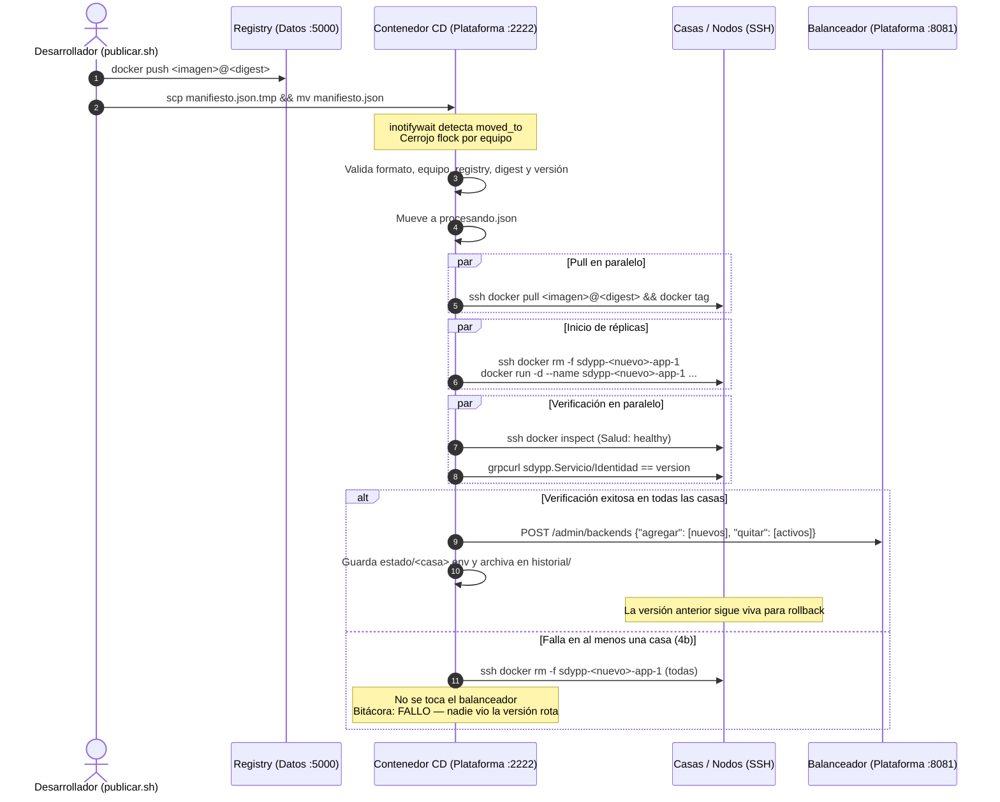

# CD Centralizado — `sdypp_cicd`

> **Sistemas Distribuidos y Paralelos · UNLu · 2C 2026**  
> Repositorio del componente de Entrega Continua (CD) centralizado en la máquina Plataforma.

Se denomina **CD** y no CI/CD a propósito: **no construye imágenes ni corre suites de integración**. La construcción y prueba de imágenes recae en el script `publicar.sh` en la máquina de cada desarrollador. El CD se encarga exclusivamente de la distribución coordinada, verificación en vivo y conmutación atómica de versiones en el balanceador.

---

## 1. Diagrama de Flujo de Despliegue



---

## 2. Decisiones de Diseño (*El por qué*)

| Decisión | Valor | Justificación Técnica (*Por qué*) |
|---|---|---|
| **Manifiesto en lugar de artefacto** | `manifiesto.json` (~200 B) vs `tar.gz` (223 MB) | Elimina la sobrecarga de red en el nodo Plataforma: el CD no transporta gigabytes de imágenes a través de su conexión. Las casas descargan únicamente las capas diferenciales directamente desde el Registry en Datos mediante `docker pull`. |
| **Sin socket de Docker (`/var/run/docker.sock`)** | No montado en el contenedor | Seguridad y mínimo privilegio: montar el socket de Docker otorgaría privilegios equivalentes a `root` sobre la máquina anfitriona (Plataforma). El CD sólo requiere SSH hacia las casas y HTTP local hacia el balanceador. |
| **`deploy.sh` en Plataforma y no en cada app** | Horneado en la imagen del CD | Superficie de ataque del plano de control reducida a cero: el endpoint `/admin/backends` del balanceador escucha exclusivamente en loopback (`127.0.0.1:8081`). Descentralizar el deploy exigiría exponer la administración del balanceador a toda la red Tailscale. |
| **Un solo POST para todas las casas** | Payload unificado `{"agregar": [...], "quitar": [...]}` | Consistencia y atomicidad en el pool de backends: evita estados transitorios donde sólo una porción de las casas esté conmutada o con tráfico fragmentado entre versiones incompatibles. |
| **Aviso por `scp` en lugar de Redis** | `scp` al puerto 2222 con clave SSH | Control de acceso y desacoplamiento: disparar despliegues requiere autorización criptográfica explícita (clave privada de deploy). Además, previene acoplar la infraestructura de entrega continua al motor de base de datos de la aplicación y evita consumir cuota de memoria (`maxmemory: 256MB`). |
| **Mantenimiento de versión anterior viva** | No se baja el contenedor anterior en el deploy | Permite **rollback instantáneo**: si la nueva versión presenta anomalías bajo tráfico real, se conmuta al balanceador hacia los contenedores previos ya en ejecución y sanos, sin reconstrucciones ni descargas adicionales. |

---

## 3. Variables de Entorno

| Variable | Default | Tipo | Descripción |
|---|---|---|---|
| `CASA` | `casa-tomas` | Informativa | Nombre del nodo donde corre el CD, utilizado en la bitácora. |
| `CASAS` | *(Obligatoria)* | Conexión | Mapeo `nombre=usuario@ip ...` de todas las casas del tailnet para generar `~/.ssh/config`. |
| `CICD_NODOS_PYTHON` | *(Obligatoria)* | Despliegue | Lista de casas asignadas al pipeline de Python (ej: `casa-tomas casa-salvador`). |
| `CICD_NODOS_JAVA` | *(Obligatoria)* | Despliegue | Lista de casas asignadas al pipeline de Java (ej: `casa-justi1 casa-justi2`). |
| `PUERTOS_CASA` | `""` | Red | Mapeo `casa=blue:green` para casas con puertos no estándar (ej: `casa-tomas=8090:8091`). Si no se especifica, por defecto es `8080:8081`. |
| `BALANCEADORES` | `http://127.0.0.1:8081` | Red | Lista de endpoints del plano de control de balanceadores (separados por espacio). |
| `REGISTRY` | `100.78.246.64:5000` | Validación | Registro seguro de imágenes para contrastar la validez de los manifiestos. |
| `INTENTOS_SALUD` | `30` | Resiliencia | Cantidad de iteraciones de comprobación de salud y versión gRPC. |
| `ESPERA_SALUD` | `2` | Resiliencia | Intervalo en segundos entre chequeos de salud (tiempo total máximo: 60 s). |
| `DIR_REMOTO` | `$HOME/sdypp` | Rutas | Directorio base de trabajo en las casas remotas (donde reside `.env` y `logs/`). |
| `CICD_BITACORA` | `/cicd/logs/cicd.log` | Auditoría | Ubicación de la bitácora persistente de operaciones. |

---

## 4. Estructura de Archivos y Volúmenes

```
/cicd/
├── bin/
│   ├── arranque.sh       # ENTRYPOINT: Genera ssh_config, permisos y supervisa sshd + vigilante
│   ├── vigilante.sh      # Monitoreo inotifywait, exclusión mutua flock y disparo de deploy.sh
│   ├── deploy.sh         # Orquestador: desplegar, conmutar, rollback y estado
│   └── contrato.proto    # Definición gRPC v2.2 para grpcurl
├── claves/               # VOLUMEN: Claves SSH
│   ├── id_deploy         # Clave privada del CD para conectar a las casas
│   ├── id_deploy.pub     # Clave pública del CD (distribuida a las casas)
│   ├── deploy-python.pub # Clave autorizada para publicar en python/entrante
│   ├── deploy-java.pub   # Clave autorizada para publicar en java/entrante
│   └── host/             # Claves de host persistentes del sshd interno
├── python/               # VOLUMEN: Pipeline Python
│   ├── entrante/         # Carpeta vigilada (procesando, rechazados, historial)
│   └── estado/           # Estado persistido por casa (<casa>.env)
├── java/                 # VOLUMEN: Pipeline Java
│   ├── entrante/
│   └── estado/
└── logs/                 # VOLUMEN: Bitácora centralizada
    └── cicd.log
```

---

## 5. Puesta en Marcha

### 5.1 Construcción de la imagen

```bash
docker build -t sdypp-cicd:local .
```

### 5.2 Despliegue del contenedor (Máquina Plataforma)

```bash
docker run -d --name sdypp-cicd \
    --restart unless-stopped \
    --network host \
    -e CASA=casa-tomas \
    -e "CASAS=casa-tomas=tomas@100.101.15.93 casa-salvador=salvador@100.91.134.43 casa-justi1=justi@100.x.y.z casa-justi2=justi@100.a.b.c" \
    -e "CICD_NODOS_PYTHON=casa-tomas casa-salvador" \
    -e "CICD_NODOS_JAVA=casa-justi1 casa-justi2" \
    -e "PUERTOS_CASA=casa-tomas=8090:8091" \
    -e BALANCEADORES="http://127.0.0.1:8081" \
    -v "$PWD/claves:/cicd/claves" \
    -v "$PWD/python:/cicd/python" \
    -v "$PWD/java:/cicd/java" \
    -v "$PWD/logs:/cicd/logs" \
    sdypp-cicd:local
```

---

## 6. Operación Manual (`deploy.sh`)

Dentro del contenedor se puede operar manualmente a través de:

```bash
# Desplegar versión según manifiesto
/cicd/bin/deploy.sh desplegar --equipo python --manifiesto /cicd/python/entrante/manifiesto.json casa-tomas casa-salvador

# Reintentar conmutación pendiente tras un fallo en el balanceador
/cicd/bin/deploy.sh conmutar --equipo python casa-tomas casa-salvador

# Realizar rollback hacia la versión anterior
/cicd/bin/deploy.sh rollback --equipo python casa-tomas casa-salvador

# Inspeccionar estado local, contenedores remotos y estado en el balanceador
/cicd/bin/deploy.sh estado --equipo python casa-tomas casa-salvador
```

---

## 7. Formato de Bitácora

Todas las acciones registran una entrada en `/cicd/logs/cicd.log`:

```
timestamp ISO | quien@casa | operación | código | detalle
```

Ejemplos:
```
2026-09-17T10:00:00-03:00 | cicd@casa-tomas | deploy | INICIO | equipo=python version=7 casas=casa-tomas casa-salvador | Iniciando despliegue de 100.78.246.64:5000/sdypp-app-python:v7-a1b2c3d
2026-09-17T10:00:25-03:00 | cicd@casa-tomas | deploy | OK | equipo=python version=7 casas=casa-tomas casa-salvador | OK version=7 casas=casa-tomas casa-salvador la anterior sigue viva
2026-09-17T10:05:10-03:00 | cicd@casa-tomas | deploy | RECHAZADO | equipo=python version=1 casas=casa-tomas casa-salvador | Equipo en manifiesto ('java') no coincide con pipeline ('python')
2026-09-17T10:10:00-03:00 | cicd@casa-tomas | rollback | OK | equipo=python version=6 casas=casa-tomas casa-salvador | Rollback exitoso a version=6
```

---

## 8. Pruebas Automatizadas

Se dispone de una suite en Bash para validar el descarte y rechazo de manifiestos mal formados o inválidos (Sección 5, punto 1):

```bash
./tests/manifiesto.sh
```
