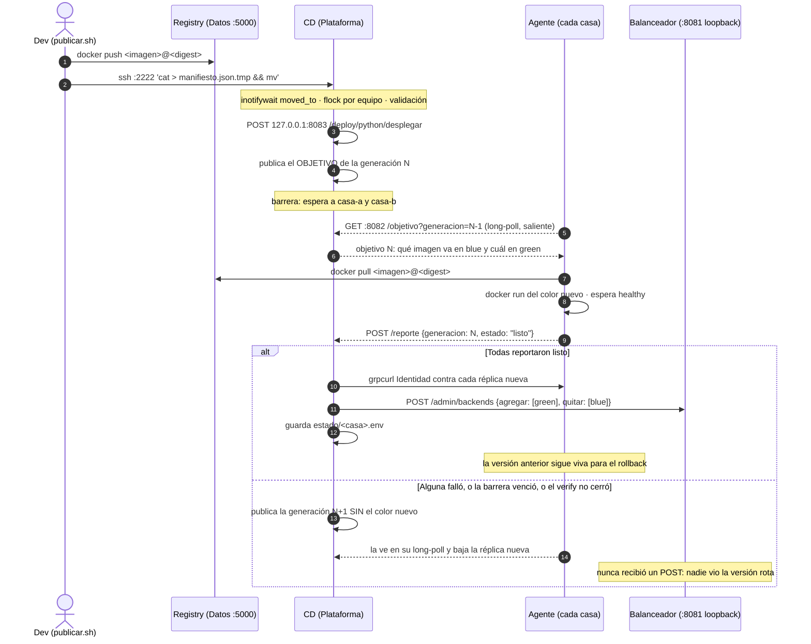

# CD declarativo con agentes — `cd`

> **Sistemas Distribuidos y Paralelos · UNLu · 2C 2026**
> Componente de Entrega Continua de la máquina Plataforma.

Se llama **CD** y no CI/CD a propósito: **no construye nada**. La imagen la construye y prueba
`publicar.sh` en la máquina del dev. El CD la distribuye y la activa.

Desde este refactor, además, **tampoco ejecuta nada en las casas**. El CD publica un *objetivo*
—el estado deseado de cada casa— y un **agente** en cada casa lo lee, converge y reporta. Todas
las conexiones las inicia la casa: **el CD nunca abre una conexión hacia una casa.**

---

## 1. Qué cambió y por qué

| Antes | Ahora |
|---|---|
| El CD hacía `ssh casa docker pull` / `docker run` | El agente de la casa lo hace, mirando el objetivo |
| La casa entregaba `sshd`, una clave ajena en `authorized_keys` y su usuario en el grupo `docker` | La casa corre un contenedor y nada más |
| `deploy.sh`: una receta imperativa; si se cortaba a la mitad, la casa quedaba a medias | El objetivo es declarativo y el agente reconcilia: es idempotente y retoma solo |
| Abortar y hacer rollback eran comandos aparte | Abortar es publicar el objetivo sin el color nuevo |

Lo que **no** cambió: el manifiesto sigue llegando por SSH al CD (`:2222`), la conmutación sigue
siendo un solo `POST /admin/backends` por loopback, la versión anterior sigue viva para el
rollback, y el contrato con el balanceador es el mismo.

El patrón es el del `kubelet`: el control plane publica el estado deseado, el nodo lo observa y
converge. La API server de Kubernetes tampoco hace SSH a los nodos.

---

## 2. Flujo de un despliegue



---

## 3. Decisiones de diseño (*el porqué*)

| Decisión | Valor | Por qué |
|---|---|---|
| **Pull en vez de push** | El agente llama al CD, nunca al revés | La casa no abre ningún puerto ni entrega una clave a nadie. Y un CD comprometido no tiene shell en la flota: lo más que puede pedir es una imagen del registry propio, porque el agente valida el objetivo con las mismas reglas que el vigilante. |
| **Declarativo en vez de imperativo** | El objetivo describe el mundo, no una acción | Hace el deploy idempotente: si el agente se reinicia a mitad de camino, vuelve a comparar y sigue. Un `deploy.sh` cortado por la mitad dejaba la casa en un estado que nadie sabía cuál era. |
| **Generación monótona** | Un entero que sólo sube | El agente descarta cualquier objetivo anterior al que ya aplicó. Sin esto, un objetivo viejo reintentado o cacheado provocaría un rollback que nadie pidió. Es el `resourceVersion` de Kubernetes. |
| **Abortar = publicar sin el color nuevo** | Un solo mecanismo | No hay comando de aborto, ni de limpieza, ni un camino de excepción que se pruebe menos que el normal. El aborto usa exactamente el mismo código que un deploy. |
| **El CD elige el color, no el agente** | El objetivo trae blue y green ya resueltos | Si cada agente decidiera, dos casas podrían discrepar y el POST al balanceador saldría con los puertos mezclados. |
| **El CD verifica por su cuenta** | `grpcurl Identidad` después de los reportes | El reporte del agente es una pista, no la prueba. No se confía en el reportante para verificar al reportante. |
| **Long-poll y no polling corto** | `GET /objetivo` se cuelga 30 s | Deploy inmediato sin que cuatro agentes martillen el tailnet. Obliga a `ThreadingHTTPServer`: con el servidor de a uno, un long-poll colgado bloquea a todos. |
| **Sin CD, el agente no toca nada** | Nunca revierte por su cuenta | Un agente que "limpia" cuando pierde contacto con el control plane es cómo se caen los sistemas de verdad. La réplica que está sirviendo sigue sirviendo. |
| **Dos sockets, no uno con filtro de IP** | `:8082` al tailnet, `127.0.0.1:8083` para el vigilante | Mismo criterio que el balanceador con su plano de control. Si el filtro por IP se escribe mal, queda un puerto abierto al tailnet que dispara deploys. |
| **Manifiesto y no artefacto** | ~200 B contra 223 MB | El CD no transporta bytes: cada casa baja del registry sólo la capa que cambió. |
| **El aviso va por SSH y no por Redis** | `ssh :2222` | Disparar un deploy requiere una clave; y no acopla la entrega continua a la base de datos de la aplicación. |
| **La versión anterior queda viva** | No se baja en el deploy | Rollback instantáneo: se conmuta a contenedores que ya están corriendo y sanos, sin reconstruir ni volver a bajar nada. |

---

## 4. Los dos componentes

```
cd/
├── consola.py            la consola de Plataforma: configura, levanta y opera el CD
├── app/control.py        el CD: publica el objetivo, corre la barrera, verifica y conmuta
├── agente/               lo que se instala en cada casa (ver agente/README.md)
├── bin/
│   ├── arranque.sh       ENTRYPOINT: claves, sshd, control.py y los dos vigilantes
│   ├── vigilante.sh      inotify sobre entrante/, valida y dispara por loopback
│   └── contrato.proto    para el grpcurl del verify
├── deploy.sh             la vía manual de respaldo (SSH). Ver §8
├── tests/
│   ├── control.py        lógica de objetivo, generación y barrera (sin Docker)
│   ├── consola.py        configuración y armado del docker run
│   ├── configurar.py     el asistente del agente
│   ├── manifiesto.sh     validación y disparo del vigilante
│   └── e2e.sh            el sistema completo con contenedores de verdad
└── python/ · java/ · claves/ · logs/     volúmenes
```

### Puertos

| Puerto | Quién | Bind | Quién entra |
|---|---|---|---|
| `2222` | `sshd` | IP de Tailscale | los devs, sólo con clave |
| `8082` | control, para los agentes | `CICD_BIND` | las casas del tailnet |
| `8083` | control, disparo | `127.0.0.1` | el vigilante del propio contenedor |

`CICD_BIND` va a la **IP de Tailscale**, no a `0.0.0.0`: con `--network host`, bindear a todas
las interfaces expone el plano de control a la red física de la casa. Mismo criterio que
`BA_ADMIN_BIND` en el balanceador y que Redis y el registry en Datos.

---

## 5. Variables de entorno

| Variable | Default | Qué |
|---|---|---|
| `CASA` | `casa-tomas` | Sale en la bitácora. |
| `CASAS` | *(obligatoria)* | `nombre=usuario@ip ...` de todas las casas. De acá sale la IP para el verify y para el POST al balanceador. |
| `CICD_NODOS_PYTHON` | *(obligatoria)* | `casa-tomas casa-salvador` |
| `CICD_NODOS_JAVA` | *(obligatoria)* | `casa-justi1 casa-justi2` |
| `PUERTOS_CASA` | `""` | `casa=blue:green` para las que no usan 8080/8081. |
| `BALANCEADORES` | `http://127.0.0.1:8081` | Planos de control a conmutar, separados por espacio. |
| `REGISTRY` | `100.91.228.65:5000` | Valida que la imagen del manifiesto salga de ahí. |
| `CICD_BIND` | `127.0.0.1` | Interfaz del socket de agentes. **En producción, la IP de Tailscale.** |
| `CICD_PUERTO_AGENTES` | `8082` | |
| `CICD_PUERTO_DISPARO` | `8083` | Siempre en loopback. |
| `CICD_PUERTO_SSH` | `2222` | Configurable porque con `--network host` puede estar ocupado. |
| `CICD_ESPERA_BARRERA` | `180` | Cuánto espera a que reporten todas las casas antes de abortar. |
| `CICD_ESPERA_LONGPOLL` | `30` | Cuánto se cuelga un `GET /objetivo` sin novedad. |
| `CICD_TOKENS` | `""` | `casa=token ...`. **Vacío (el default) = sin autenticación**, que es como corre hoy el grupo. |
| `CICD_BITACORA` | `/cicd/logs/cicd.log` | |

**Sobre `CICD_TOKENS`:** es opcional y hoy **no se usa**. El tailnet ya autentica a nivel de red, y
adentro sólo están las máquinas del grupo.

Lo que agregarían: sin tokens, cualquiera que llegue al `:8082` puede mandar un
`POST /reporte {"casa": "otra", "estado": "fallo"}` y **abortar el deploy en curso** — la barrera
cierra apenas una casa reporta un fallo, así que eso pasa antes de que el `grpcurl` del verify
llegue a correr. Un reporte falso de `"listo"`, en cambio, no alcanza para desplegar algo roto:
el CD verifica la versión él mismo.

Si algún día se activan, son **todo o nada**: en cuanto `CICD_TOKENS` trae aunque sea uno, todas
las casas necesitan el suyo, y una con token vacío no es una excepción sino un agujero. El
`/health` publica `pideToken` para que el asistente del agente sepa si tiene que pedirlo.

---

## 6. Puesta en marcha

```bash
python3 consola.py
```

La primera vez arma la configuración preguntando lo que hace falta y levanta el CD. Después es el
menú desde el que se opera todo:

```
  CD · Plataforma · casa-tomas
  CD arriba · generaciones python=18 java=0 · 3 casas  ·  balanceador 3/3 sanas

  1  Desplegar                redesplegar un manifiesto ya publicado
  2  Nodos conocidos          casas, color activo, versión y último reporte
  3  Balanceador              qué réplicas están en rotación
  4  Rollback                 volver a la versión anterior
  5  Casas                    agregar, quitar, ver
  6  Bitácora                 últimas 30 líneas
  7  Contenedor del CD        levantar, reiniciar, bajar, logs
  8  Configuración            ver y editar
  0  Salir
```

La configuración queda en **`plataforma.env`**, que no es un archivo de la consola sino
literalmente el `--env-file` del contenedor: lo que se ve ahí es lo que el CD tiene. La opción 8
muestra el `docker run` equivalente, por si hay que correrlo a mano.

Un par de cosas que la consola hace y conviene saber:

- **Desplegar (1)** lista los manifiestos del historial y muestra la bitácora en vivo mientras el
  deploy corre. El camino normal sigue siendo `publicar.sh` desde la máquina de un dev; esto es
  para redesplegar: sumar una casa nueva, o reintentar.
- **Agregar una casa (5)** guarda la configuración, te imprime **lo que hay que pasarle a esa
  máquina** y ofrece reiniciar el CD.
- **Rollback (4)** muestra casa por casa a qué color y versión volvería, y recién después pregunta.

### A mano, si preferís

```bash
docker build -t sdypp-cd:local .
docker run -d --name sdypp-cd --restart unless-stopped --network host \
    --env-file plataforma.env \
    -v "$PWD/claves:/cicd/claves" -v "$PWD/python:/cicd/python" \
    -v "$PWD/java:/cicd/java"     -v "$PWD/logs:/cicd/logs" \
    sdypp-cd:local
```

Ni `-v /var/run/docker.sock`, ni `BA_ADMIN_*`, ni contraseñas.

En cada casa, el agente se instala con su asistente —`python3 agente/configurar.py`—, que pregunta
lo que falta, comprueba contra el CD, Redis y el registry antes de levantar nada, y avisa si el
nombre de casa no figura en `CICD_NODOS_*`. Detalle en **`agente/README.md`**.

Para mirarlo:

```bash
curl -s http://100.101.15.93:8082/health | jq
docker exec sdypp-cd curl -s http://127.0.0.1:8083/deploy/python/estado | jq
docker exec sdypp-cd curl -s -X POST http://127.0.0.1:8083/deploy/python/rollback | jq
tail -f logs/cicd.log
```

---

## 6.1 Sumar una casa

El orden importa: el CD tiene que conocerla **antes** de que su agente arranque, porque el
asistente comprueba contra la lista del CD y se planta si el nombre no figura.

1. **La máquina nueva** entra al tailnet y dice su IP (`tailscale ip -4`).
2. **En Plataforma**: `python3 consola.py` → **5** (Casas) → **1** (Agregar). Pide nombre, equipo,
   IP y puertos, guarda, imprime lo que hay que pasarle a esa máquina y ofrece reiniciar el CD.
   Reiniciar no corta tráfico y **la generación sobrevive** (vive en `python/estado/generacion`).
3. **En la máquina nueva**: Docker, `insecure-registries`, `ufw`, y `python3 agente/configurar.py`.
4. **En Plataforma**: `consola.py` → **1** (Desplegar) → el manifiesto que quieras. Las casas que
   ya estaban levantan el color opuesto con la misma imagen y conmutan; la nueva, que no tiene
   estado, arranca en blue. Sin corte: es un deploy normal.

Sin `CICD_TOKENS` no hay nada más que hacer: el asistente le pregunta al CD si pide token
(`pideToken` del `/health`) y, si no, ni lo menciona.

Si algún día se activan, son **todo o nada** y hay que generarlos para todas las casas en la
misma pasada. Un agente rechazado lo dice en su bitácora (`objetivo | RECHAZADO`) y el CD también
(`acceso | RECHAZADO`, con la casa y la IP); sin esas líneas, un deploy abortado por token se ve
sólo como `sin reporte: [...]` y manda a revisar la red en vez de una variable.

---

## 7. Bitácora

Formato común del grupo: `timestamp | quien@casa | operación | código | detalle`.

| Operación | Códigos | Quién |
|---|---|---|
| `manifiesto` | `RECIBIDO` · `RECHAZADO` · `ARCHIVADO` | el vigilante |
| `control` | `ARRIBA` · `ABAJO` | el control |
| `objetivo` | `PUBLICADO` | el control |
| `reporte` | `ANOTADO` · `GENERACION-VIEJA` · `CASA-NO-ESPERADA` | el control |
| `acceso` | `RECHAZADO` | el control, ante un token inválido o ausente |
| `deploy` · `rollback` | `INICIO` · `OK` · `FALLO` | el control |

`GENERACION-VIEJA` no es un error: es un agente que aplicó el objetivo de aborto y reportó
después de que la barrera ya cerró. Sirve para seguir la secuencia.

---

## 8. `deploy.sh` — la vía de respaldo

`deploy.sh` (el CD anterior, por SSH) sigue en el repo y **ya no lo usa nadie en el camino normal**:
el vigilante dispara contra el control. Queda como herramienta manual para una casa que todavía no
tenga el agente instalado. Usarlo exige lo de antes: `sshd`, la clave del CD en `authorized_keys` y
el usuario en el grupo `docker`.

Cuando las cuatro casas tengan el agente, se borra `deploy.sh`, sale `openssh-client` del
`Dockerfile` y con eso desaparece el último SSH saliente del CD.

---

## 9. Pruebas

```bash
python3 tests/control.py     # 27 casos: objetivo, generación, barrera, validación
python3 tests/consola.py     # 12 casos: configuración de Plataforma y docker run
python3 tests/configurar.py  # 12 casos: validaciones y archivos del asistente
./tests/manifiesto.sh        # 19 casos: validación del manifiesto y disparo del vigilante
./tests/e2e.sh               # el sistema completo, con Docker
./tests/e2e.sh --dejar       # ídem, pero deja todo andando para mirarlo
./tests/e2e.sh --limpiar     # borra lo que haya quedado
```

`e2e.sh` levanta un registry, dos casas con su agente, el balanceador y el CD en una sola máquina,
y comprueba:

1. **Primer deploy** — no había nada: arranca en blue, el balanceador queda con las dos réplicas.
2. **Segundo deploy** — conmuta blue→green y la anterior **sigue corriendo** para el rollback.
3. **Deploy mentiroso** — el manifiesto dice `version: 7` y la imagen responde `99`: el CD lo
   detecta en el verify, publica el objetivo de aborto, los agentes bajan la réplica nueva y
   **el balanceador nunca recibe el POST**.
4. **Idempotencia** — se republica el objetivo vigente y el agente contesta `ya coincide` sin tocar
   un contenedor.
5. **Migración** — una réplica levantada a mano, sin las etiquetas del agente, sobrevive al primer
   deploy: el agente la adopta en vez de recrearla.
6. **Reinicio del CD** — la generación sobrevive y se puede seguir desplegando.

La réplica de `tests/e2e/app/` es de mentira: implementa sólo `Identidad`, `Salud` y el health de
gRPC, lo justo para que el CD y el balanceador la traten como real. Así el e2e no depende del repo
de ninguna app.
